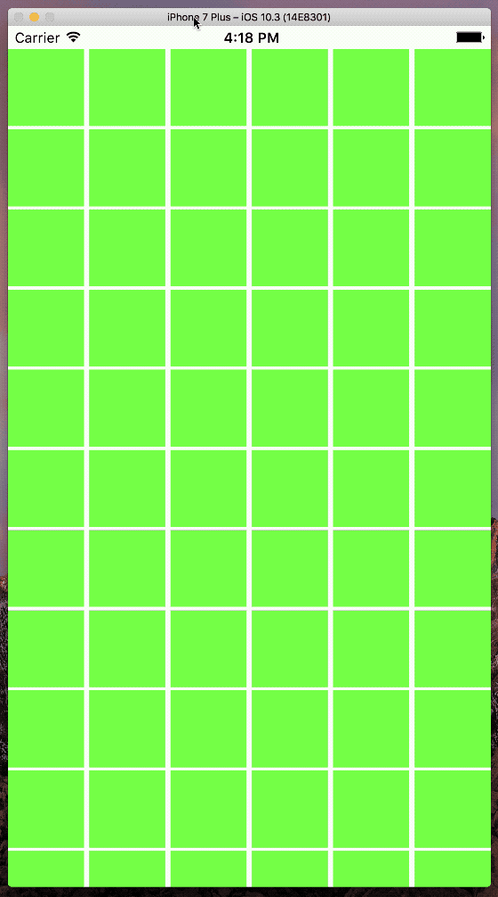
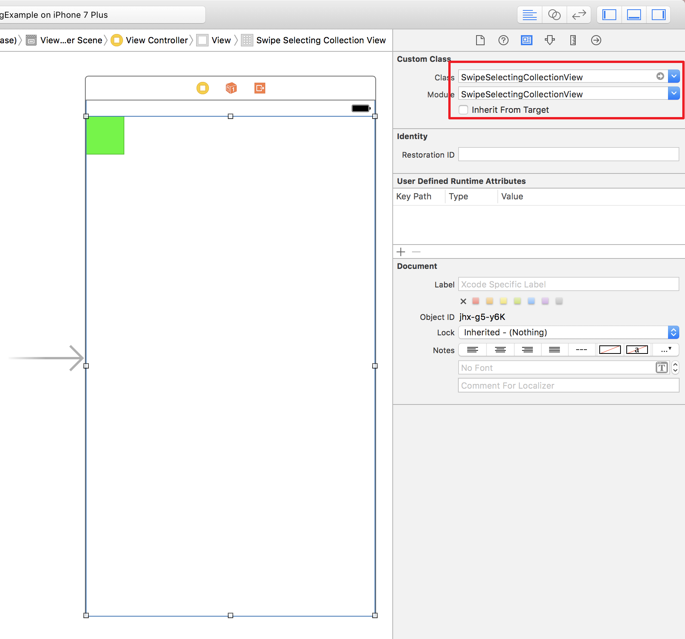

# SwipeSelectingCollectionView
> A collection view subclass that enables swipe to select multiple cells just like in Photos app.

[](https://swift.org/)
[](https://www.apple.com/)



## Requirements

- Swift 4.0+
- iOS 8.0+
- Xcode 7.3+

## Installation

#### CocoaPods
You can use [CocoaPods](http://cocoapods.org/) to install `SwipeSelectingCollectionView` by adding it to your `Podfile`:

```ruby
platform :ios, '8.0'
use_frameworks!
pod 'SwipeSelectingCollectionView'
```

To get the full benefits import `SwipeSelectingCollectionView` wherever you import UIKit

``` swift
import UIKit
import SwipeSelectingCollectionView
```

#### Manually
1. Download and drop ```SwipeSelectingCollectionView.xcodeproj``` in your project.  
2. Congratulations!  

## Usage example

#### Programmatically

```swift
import SwipeSelectingCollectionView

let collectionView = CollectionView(frame: .zero, collectionViewLayout: UICollectionViewFlowLayout()) 
```

#### Interface Builder



## Contribute

We would love you for the contribution to **SwipeSelectingCollectionView**, check the ``LICENSE`` file for more info.

## Meta

Shane Qi – [@shadowqi](https://twitter.com/shadowqi) – qizengtai@gmail.com

Distributed under the Apache License 2.0. See ``LICENSE`` for more information.

[https://github.com/shaneqi/SwipeSelectingCollectionView](https://github.com/shaneqi/SwipeSelectingCollectionView)
